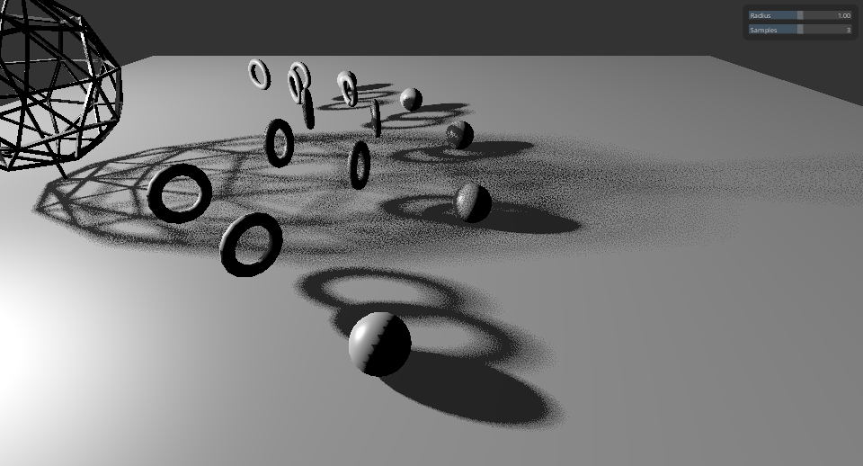
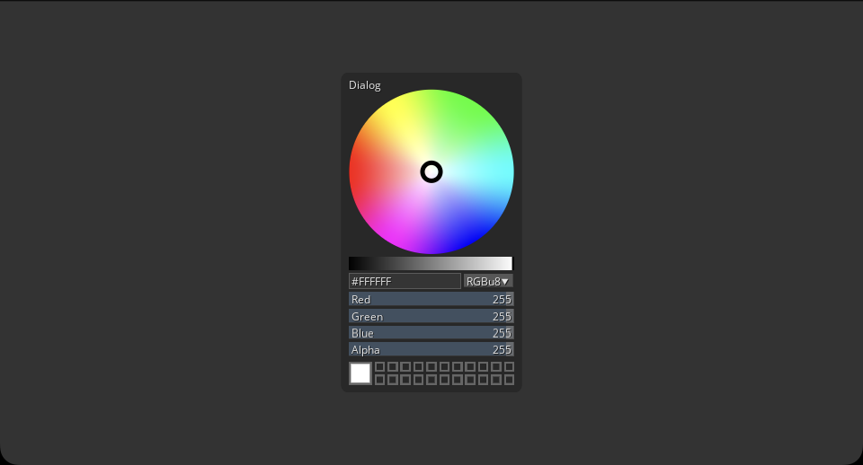
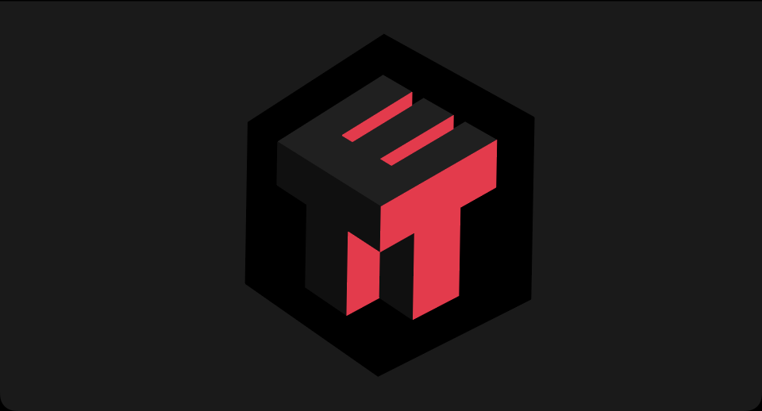
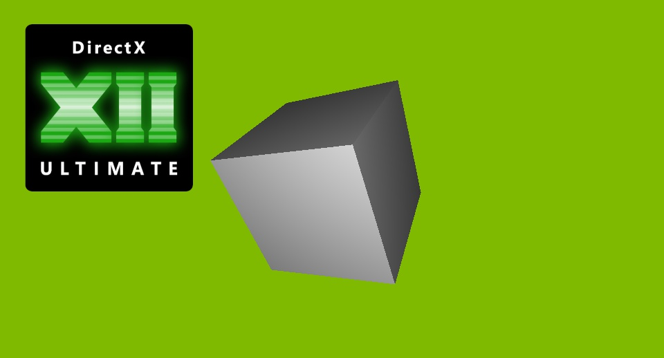
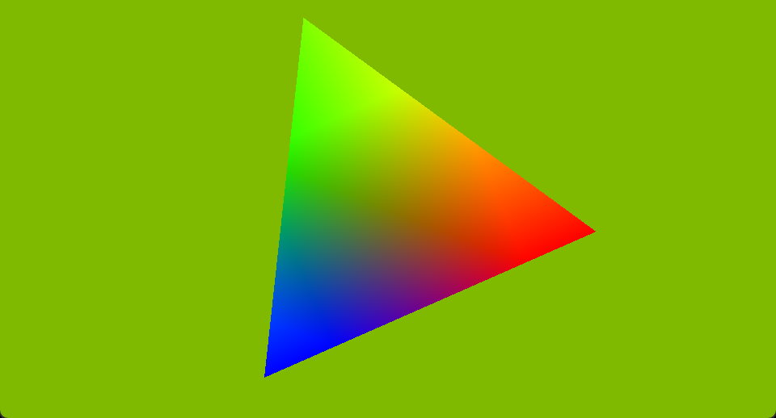
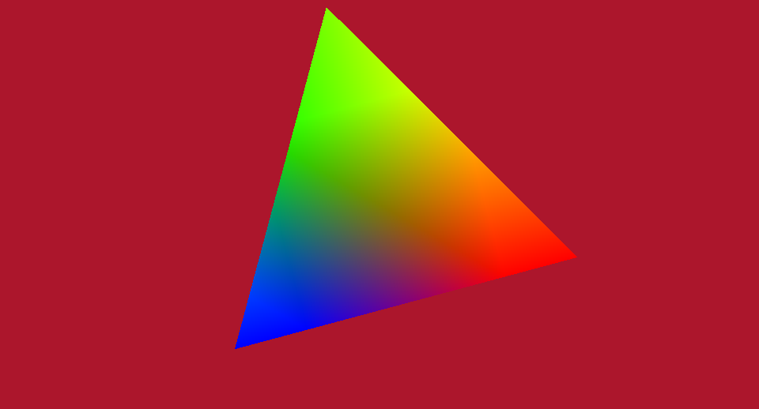

# Tellusim Core SDK

Tellusim Core SDK is the foundational layer of the Tellusim Engine, providing low-level functionality for high-performance graphics, compute, and application development across multiple platforms and devices. It offers a unified C++ API designed to abstract hardware and OS differences, enabling developers to write portable and scalable applications in graphics, simulation, visualization, and AI.

The SDK includes comprehensive support for meshes, images, user interfaces, and GPU-accelerated algorithms such as radix sort, bounding volume hierarchies (BVH), fast Fourier transforms (FFT), and GPU-driven computational graph framework for machine learning and advanced data processing.

In addition to C++, the SDK provides bindings and interoperability for other languages such as C#, Rust, Swift, and Python, making it suitable for use in native mobile and desktop applications as well as game and graphics engines.

Happy coding, and have fun creating with Tellusim!

## Licensing

* Core SDK is free for education
* Core SDK is free for companies with annual revenue < $200K
* Any other licensing terms are negotiable

For inquiries, visit: [Tellusim Services](https://tellusim.com/services/)

## Documentation & Downloads

[Tellusim Core SDK Documentation](https://docs.tellusim.com/core)

[Prebuilt SDK Builds for All Platforms](https://tellusim.com/core)

# Graphics

## [Clustered Lights](https://github.com/Tellusim/Tellusim_Core_SDK/tree/main/samples/graphics/lights)

Forward shading with 16384 dynamic lights. This algorithm is compatible with deferred shading and transparent objects.

---

## [Meshlet Render](https://github.com/Tellusim/Tellusim_Core_SDK/tree/main/samples/graphics/meshlet)

A massive meshlets rendering example with Mesh Shader for hardware and Compute Shader for software rasterization.

'1' activates Instancing mode.

'2' activates Mesh Shader mode.

'3' activates Compute rasterization mode.

---

## [Mesh RayTracing](https://github.com/Tellusim/Tellusim_Core_SDK/tree/main/samples/graphics/traversal)

Traversal class for the simple raytracing pipeline access. Vulkan or Direct3D12 API is required.

---

## [Mesh RayQuery](https://github.com/Tellusim/Tellusim_Core_SDK/tree/main/samples/graphics/tracing)

Ray Query raytracing of animated scene. Vulkan, Direct3D12, or Metal API is required.

'1' activates Fragment Shader raytracing (if available).

---

## [Hardware RayTracing](https://github.com/Tellusim/Tellusim_Core_SDK/tree/main/samples/graphics/skinned_tracing)

Hardware accelerated RayTracing of animated objects.

---

## [Compute RayTracing](https://github.com/Tellusim/Tellusim_Core_SDK/tree/main/samples/graphics/skinned_tree)

Compute Shader RayTracing of animated objects.

---

## [Hardware RayTracing](https://github.com/Tellusim/Tellusim_Core_SDK/tree/main/samples/graphics/mesh_tracing)

Hardware accelerated RayTracing of high-polygonal objects.

---

## [Compute RayTracing](https://github.com/Tellusim/Tellusim_Core_SDK/tree/main/samples/graphics/mesh_tree)

Compute Shader RayTracing of high-polygonal objects.

---

## [JPEG Decoder](https://github.com/Tellusim/Tellusim_Core_SDK/tree/main/samples/graphics/decoder_jpeg)

The DecoderJPEG provides GPU-accelerated JPEG decoding functionality.

---

## [Cube Filter](https://github.com/Tellusim/Tellusim_Core_SDK/tree/main/samples/graphics/cube_filter)

The CubeFilter interface performs real-time Cube texture filtration.

---

## [Separable Filter](https://github.com/Tellusim/Tellusim_Core_SDK/tree/main/samples/graphics/separable_filter)

The SeparableFilter interface helps to create different separable filters like Gaussian, Sobel, Box, and custom weights.

---

## [Indirect Draw](https://github.com/Tellusim/Tellusim_Core_SDK/tree/main/samples/graphics/indirect)

Drawing massive amount of quads using different indirect rendering techniques.

---

## [Geometry Shader](https://github.com/Tellusim/Tellusim_Core_SDK/tree/main/samples/graphics/geometry)

Rendering massive amount of boxes with Geometry Shaders.

'1' activates Vertex Shader mode.

'2' activates Mesh Shader mode (if available).

---

## [Tessellation Shader](https://github.com/Tellusim/Tellusim_Core_SDK/tree/main/samples/graphics/tessellation)

Quadrilateral tessellation with Control + Evaluate or Mesh Shaders.

'1' activates Mesh Shader tessellation mode (if available).

---

## [Ordered Independent Transparency](https://github.com/Tellusim/Tellusim_Core_SDK/tree/main/samples/graphics/transparency)

Ordered Independent Transparency with atomic buffer operations from the fragment shader.

---

## [Hardware Ray Tracing Shadows](https://github.com/Tellusim/Tellusim_Core_SDK/tree/main/samples/graphics/shadow_tracing)

Hardware raytracing shadows with simple deferred shading. An API with Ray Query support is required.

---

## [Software Ray Tracing Shadows](https://github.com/Tellusim/Tellusim_Core_SDK/tree/main/samples/graphics/shadow_tree)

Software raytracing shadows with simple deferred shading. Compatible with all APIs.

---

## [Percentage Closer Filtering Shadow Map](https://github.com/Tellusim/Tellusim_Core_SDK/tree/main/samples/graphics/shadow_pcf)

PCF Shadow Maps provides shadow with variable penumbra size based on the distance between the shadow caster and receiver.

---

## [Exponential Shadow Maps](https://github.com/Tellusim/Tellusim_Core_SDK/tree/main/samples/graphics/shadow_esm)

Exponential Shadow Maps provides noise-free shadows with a fixed performance cost and constant penumbra size.

---

## [Parallax 2D](https://github.com/Tellusim/Tellusim_Core_SDK/tree/main/samples/graphics/parallax_2d)

Parallax occlusion mapping with self-shadowing for the mesh geometry.

---

## [Parallax Cube](https://github.com/Tellusim/Tellusim_Core_SDK/tree/main/samples/graphics/parallax_cube)

Parallax occlusion mapping with self-shadowing for the analytical sphere.

---

## [Mesh Tangent Basis](https://github.com/Tellusim/Tellusim_Core_SDK/tree/main/samples/graphics/tangent)

Mesh tangent basis renormalization at the Fragment Shader. Mesh class can re-create normal and tangent vectors.

---

## [Mesh Model](https://github.com/Tellusim/Tellusim_Core_SDK/tree/main/samples/graphics/model)

MeshModel class creates a rendering model representation for the input Mesh or MeshGeometry with a specified Pipeline layout.

It is possible to inherit MeshModel class and combine multiple meshes into the single Buffer.

---

## [Mesh Morphing](https://github.com/Tellusim/Tellusim_Core_SDK/tree/main/samples/graphics/morph)

This is a basic morph mesh animation example. AttributeIndex provides a stable mapping between source and optimized vertices. Texel Buffer acts as a workaround for platforms that lack compute shader support.

---

## [Mesh Skinning](https://github.com/Tellusim/Tellusim_Core_SDK/tree/main/samples/graphics/skinned)

This is a basic skinned mesh animation example. Mesh classes give comprehensive access to all mesh data, including Nodes, Animations, Materials, Cameras, and Lights.

---

## [Multi Window](https://github.com/Tellusim/Tellusim_Core_SDK/tree/main/samples/graphics/multi_window)

Rendering scene into multiple borderless windows.

---

## [Line Rendering](https://github.com/Tellusim/Tellusim_Core_SDK/tree/main/samples/graphics/line)

Simple antialiased line rendering. The Vertex shader creates a screen-aligned billboard, and the fragment shader calculates the distance to the line.

# Platform

## [Platform Precision](https://github.com/Tellusim/Tellusim_Core_SDK/tree/main/samples/platform/precision)

Performance and precision difference between 16-bit, 32-bit, and 64-bit floating formats.

'1' activates 64-bit precision.

'2' activates 16-bit precision.

---

## [Platform Bindless](https://github.com/Tellusim/Tellusim_Core_SDK/tree/main/samples/platform/bindless)

This example demonstrates bindless Buffer and Texture resources indexed by InstanceIndex. Vulkan, Direct3D12, or Metal API is required.

---

## [Platform TextureTable](https://github.com/Tellusim/Tellusim_Core_SDK/tree/main/samples/platform/table)

TextureTable is an interface for an unlimited number of bindless textures that can be accessed from any shader by uniform or non-uniform index. Vulkan, Direct3D12, or Metal API is required.

---

## [Platform Texel](https://github.com/Tellusim/Tellusim_Core_SDK/tree/main/samples/platform/texel)

Texel buffer provides cached buffer access that is compatible with OpenGLES platform. Moreover, it can work faster than the Storage buffer in some scenarios.

---

## [Platform Texture](https://github.com/Tellusim/Tellusim_Core_SDK/tree/main/samples/platform/texture)

Dynamic 3D texture created with SIMD CPU instructions.

---

## [Platform Command](https://github.com/Tellusim/Tellusim_Core_SDK/tree/main/samples/platform/command)

Command class for basic rendering. Depth Cube texture for omnidirectional shadow map.

---

## [Platform Tracing](https://github.com/Tellusim/Tellusim_Core_SDK/tree/main/samples/platform/tracing)

Hardware accelerated raytracing shadows. An API with Ray Query support is required.

---

## [Platform Compute](https://github.com/Tellusim/Tellusim_Core_SDK/tree/main/samples/platform/compute)

Compute class for simple compute shader texture generation.

---

## [Platform Fence](https://github.com/Tellusim/Tellusim_Core_SDK/tree/main/samples/platform/fence)

Multi-GPU N-body simulation with Fence synchronization. A shared buffer is used for data exchange between GPUs.

---

## [Platform Fence](https://github.com/Tellusim/Tellusim_Core_SDK/tree/main/samples/platform/shared)

Multi-GPU synchronization with fences and semaphores.

---

## [Platform Sparse](https://github.com/Tellusim/Tellusim_Core_SDK/tree/main/samples/platform/sparse)

This example shows how sparse textures allow handling very large textures by allocating only the needed tiles in GPU memory

---

## [Platform Mapped](https://github.com/Tellusim/Tellusim_Core_SDK/tree/main/samples/platform/mapped)

This example shows how Vulkan can map files into GPU buffers, allowing the GPU to read from and write to files directly without extra copying.

---

## [Platform Mapped](https://github.com/Tellusim/Tellusim_Core_SDK/tree/main/samples/platform/formats)

This example shows how mixed texture formats can reduce video memory consumption. Image format conversion is performed by the Image interface.

---

## [Platform Dynamic](https://github.com/Tellusim/Tellusim_Core_SDK/tree/main/samples/platform/dynamic)

A single-thread dynamic geometry rendering can provide more than 100M triangles per second rate.

---

## [Platform Clip Planes](https://github.com/Tellusim/Tellusim_Core_SDK/tree/main/samples/platform/clipping)

Vertex Shader clip distance output is useful for arbitrary geometry culling.

---

## [Platform Stencil Buffer](https://github.com/Tellusim/Tellusim_Core_SDK/tree/main/samples/platform/stencil)

Constructive Solid Geometry with the Stencil Buffer. This algorithm is compatible with procedural geometry.

---

## [Platform Fusion](https://github.com/Tellusim/Tellusim_Core_SDK/tree/main/samples/platform/fusion)

Fusion API allows replicating all commands and resources across multiple physical or logical devices. It dramatically simplifies the development of apps for multi-GPU or multi-channel rendering.

---

## [Platform Layers](https://github.com/Tellusim/Tellusim_Core_SDK/tree/main/samples/platform/layers)

Demonstrates multilayer rendering where the target layer is selected dynamically in the Vertex Shader, Geometry Shader, or Geometry Passthrough Shader.

---

## [Platform Viewports](https://github.com/Tellusim/Tellusim_Core_SDK/tree/main/samples/platform/viewports)

Demonstrates multi-viewport rendering with dynamic viewport selection in the Vertex Shader, Geometry Shader, or Geometry Passthrough Shader.

---

## [Platform Samplers](https://github.com/Tellusim/Tellusim_Core_SDK/tree/main/samples/platform/samplers)

Demonstrates various texture sampler configuration modes.

---

## [Barycentric Coordinates](https://github.com/Tellusim/Tellusim_Core_SDK/tree/main/samples/platform/barycentric)

Build-in barycentric coordinate input is available in Vulkan, Direct3D12, and Metal APIs.

---

## [Multi Draw Indirect](https://github.com/Tellusim/Tellusim_Core_SDK/tree/main/samples/platform/indirect)

This example performs MDI rendering of different objects.

---

## [MSAA Alpha Test](https://github.com/Tellusim/Tellusim_Core_SDK/tree/main/samples/platform/alpha)

MSAA-compatible alpha test in comparison to hardware alpha to coverage.

---

## [Input Blending Color](https://github.com/Tellusim/Tellusim_Core_SDK/tree/main/samples/platform/blending)

Blending color parameter defines uniform value for blending operations.

---

## [Multisample Antialiasing](https://github.com/Tellusim/Tellusim_Core_SDK/tree/main/samples/platform/multisample)

This example performs AA line rendering into MSAA texture.

---

## [Platform Preprocessor](https://github.com/Tellusim/Tellusim_Core_SDK/tree/main/samples/platform/preprocessor)

This example demonstrates how to use the #include preprocessor directive to declare generic functions.

---

## [Platform Texture Samples](https://github.com/Tellusim/Tellusim_Core_SDK/tree/main/samples/platform/samples)

Writing and reading individual multisample texture samples with active Pipeline sample write mask.

---

## [Conservative Rasterization](https://github.com/Tellusim/Tellusim_Core_SDK/tree/main/samples/platform/conservative)

Hardware conservative rasterization.

---

## [Cooperative Matrix (Tensor Cores)](https://github.com/Tellusim/Tellusim_Core_SDK/tree/main/samples/platform/cooperative)

Cooperative matrix example.

---

## [Matrix Multiplication](https://github.com/Tellusim/Tellusim_Core_SDK/tree/main/samples/platform/matrix)

Matrix multiplication example.

---

## [Subgroup operations](https://github.com/Tellusim/Tellusim_Core_SDK/tree/main/samples/platform/subgroup)

Shader subgroup operations.

---

## [Structure references](https://github.com/Tellusim/Tellusim_Core_SDK/tree/main/samples/platform/reference)

This test showcases GLSL structure mapping to raw SSBO buffer, enabling storage of data with different layouts within a single SSBO buffer.

---

## [Shader Printf](https://github.com/Tellusim/Tellusim_Core_SDK/tree/main/samples/platform/printf)

A simple preprocessor-based printf() functionality for compute shaders that work with all APIs.

# Interface

## [Interface Canvas](https://github.com/Tellusim/Tellusim_Core_SDK/tree/main/samples/interface/canvas)

Different CanvasElement classes, including texture filtration, gradients, contour outlines, and SVG rendering.

---

## [Interface Controls](https://github.com/Tellusim/Tellusim_Core_SDK/tree/main/samples/interface/controls)

Different User Interface Control classes in resolution-independent configuration.

---

## [SVG](https://github.com/Tellusim/Tellusim_Core_SDK/tree/main/plugins/interface/svg)

This plugin enables SVG images support for Control widgets.

[docs.tellusim.com/core/plugins/interface/svg](https://docs.tellusim.com/core/plugins/interface/svg)

---

## [Flow](https://github.com/Tellusim/Tellusim_Core_SDK/tree/main/plugins/interface/flow)

Flow Control is a universal node-based editor designed for a variety of applications, including material and logic editing. It includes base implementations in both GLSL and C++.

[docs.tellusim.com/core/plugins/interface/flow](https://docs.tellusim.com/core/plugins/interface/flow)

---

## [Color](https://github.com/Tellusim/Tellusim_Core_SDK/tree/main/plugins/interface/color)

Color selector control.

[docs.tellusim.com/core/plugins/interface/color](https://docs.tellusim.com/core/plugins/interface/color)

---

## [Interface Element](https://github.com/Tellusim/Tellusim_Core_SDK/tree/main/plugins/interface/element)

A CanvasElement wrapper that allows elements to be rendered and manipulated inside a Controls widgets.

[docs.tellusim.com/core/plugins/interface/element](https://docs.tellusim.com/core/plugins/interface/element)

---

## [Button](https://github.com/Tellusim/Tellusim_Core_SDK/tree/main/plugins/interface/button)

A generic button controller that uses custom Canvas elements as Control button.

[docs.tellusim.com/core/plugins/interface/button](https://docs.tellusim.com/core/plugins/interface/button)

---

## [Slider](https://github.com/Tellusim/Tellusim_Core_SDK/tree/main/plugins/interface/slider)

A generic slider controller that uses custom Canvas elements as Control slider.

[docs.tellusim.com/core/plugins/interface/slider](https://docs.tellusim.com/core/plugins/interface/slider)

---

## [Plotter](https://github.com/Tellusim/Tellusim_Core_SDK/tree/main/plugins/interface/plotter)

A simple line plotter visualization plugin.

[docs.tellusim.com/core/plugins/interface/plotter](https://docs.tellusim.com/core/plugins/interface/plotter)

---

## [Tooltip](https://github.com/Tellusim/Tellusim_Core_SDK/tree/main/plugins/interface/tooltip)

A generic tooltip Control allows the display of help information over other interface controls.

[docs.tellusim.com/core/plugins/interface/tooltip](https://docs.tellusim.com/core/plugins/interface/tooltip)

---

## [Interface Layer](https://github.com/Tellusim/Tellusim_Core_SDK/tree/main/samples/interface/layer)

A transparent multilayer Controls with variable background blur.

---

## [Manipulator Plugin](https://github.com/Tellusim/Tellusim_Core_SDK/tree/main/plugins/interface/manipulator)

Manipulator is a simple translator and rotator control for the scene editor.

[docs.tellusim.com/core/plugins/interface/manipulator](https://docs.tellusim.com/core/plugins/interface/manipulator)

---

## [App](https://github.com/Tellusim/Tellusim_Core_SDK/tree/main/plugins/interface/app)

This plugin provides a framework for single-window Control-based applications.

[docs.tellusim.com/core/plugins/interface/app](https://docs.tellusim.com/core/plugins/interface/app)

---

## [Shape](https://github.com/Tellusim/Tellusim_Core_SDK/tree/main/tests/interface/shape)

This example renders cubic shape with applied Stroke and Gradient styles.

---

## [SVG Image](https://github.com/Tellusim/Tellusim_Core_SDK/tree/main/tests/interface/svg)

Simple SVG image loading and rendering. CanvasShape class accepts SVG path string as input data.

---

## [Custom Control](https://github.com/Tellusim/Tellusim_Core_SDK/tree/main/samples/interface/control)

Custom Controls can be created by simple ControlBase class inheritance. The Control behavior can be completely overridden.

# Parallel

## [Parallel TensorGraph from PyTorch](https://github.com/Tellusim/Tellusim_Core_SDK/tree/main/samples/parallel/tensor_torch)

Simple convolutional autoencoder trained with PyTorch and imported into TensorGraph.

---

## [Parallel TensorGraph MNIST Digits Recognition](https://github.com/Tellusim/Tellusim_Core_SDK/tree/main/samples/parallel/tensor_mnist)

MNIST Digits Recognition using TensorGraph with PyTorch model.

---

## [Parallel Fourier 2D](https://github.com/Tellusim/Tellusim_Core_SDK/tree/main/samples/parallel/fourier_2d)

Image convolution based on Fast Fourier Transformation.

---

## [Parallel Fluid 2D](https://github.com/Tellusim/Tellusim_Core_SDK/tree/main/samples/parallel/fluid_2d)

Simple 2D fluid simulation based on Fast Fourier Transformation.

---

## [Parallel Radix Sort](https://github.com/Tellusim/Tellusim_Core_SDK/tree/main/samples/parallel/radix_sort)

Multiple independent sorting algorithms can be dispatched in parallel. There is no overhead in comparision with the single array sort. Additionally, dispatch parameters can be fetched from the indirect buffer.

'1' shows the input data.

'2' activates global sort.

---

## [Parallel Spatial Grid](https://github.com/Tellusim/Tellusim_Core_SDK/tree/main/samples/parallel/spatial_grid)

Simple physics simulation with collisions based on the SpatialGrid class. It is the fastest way to collide objects of the same size.

---

## [Parallel Spatial Tree](https://github.com/Tellusim/Tellusim_Core_SDK/tree/main/samples/parallel/spatial_tree)

Simple physics simulation with collisions based on the SpatialTree class. The SpatialTree allows collision and intersection tests with any primitive inside BVH.

# Geometry

## [Mesh Reduce](https://github.com/Tellusim/Tellusim_Core_SDK/tree/main/samples/geometry/reduce)

MeshReduce is a simple way to simplify input mesh geometry. Simplification preserves all Mesh Attributes, and it is compatible with Skinning Animation.

'1' shows the original geometry.

---

## [Mesh Refine](https://github.com/Tellusim/Tellusim_Core_SDK/tree/main/samples/geometry/refine)

MeshRefine refines geometry mesh using Catmull-Clark (for quadrilaterals) or Loop (for triangles) subdivision algorithms. The Crease Attribute allows additional control over the subdivision process.

'1' shows the original geometry.

# Plugins

## [Open Neural Network Exchange](https://github.com/Tellusim/Tellusim_Core_SDK/tree/main/plugins/parallel/onnx)

The ONNX plugin allows loading and running ONNX models with TensorGraph on all platforms and APIs.

[docs.tellusim.com/core/plugins/parallel/onnx](https://docs.tellusim.com/core/plugins/parallel/onnx)

---

## [OpenXR](https://github.com/Tellusim/Tellusim_Core_SDK/tree/main/plugins/platform/openxr)

OpenXR VR/AR plugin. Supports Vulkan, Direct3D12, Direct3D11, OpenGL APIs on PC; Vulkan, OpenGLES on Android. This plugin creates an OpenXR-compatible output window with any number of channels. The input layer provides a simplified API for the OpenXR input system.

[docs.tellusim.com/core/plugins/platform/openxr](https://docs.tellusim.com/core/plugins/platform/openxr)

---

## [Native Cuda driver API](https://github.com/Tellusim/Tellusim_Core_SDK/tree/main/plugins/platform/cuda)

Create dynamic geometry with Cuda and render with Vulkan / Direct3D / OpenGL.

[docs.tellusim.com/core/plugins/platform/cuda](https://docs.tellusim.com/core/plugins/platform/cuda)

---

## [Native Vulkan runtime](https://github.com/Tellusim/Tellusim_Core_SDK/tree/main/plugins/platform/vulkan)

You can use this plugin to write applications with native Vulkan API. All Tellusim platform classes give access to internal Vulkan handlers and can be used in Vulkan API calls.

[docs.tellusim.com/core/plugins/platform/vulkan](https://docs.tellusim.com/core/plugins/platform/vulkan)

---

## [Native OpenGL runtime](https://github.com/Tellusim/Tellusim_Core_SDK/tree/main/plugins/platform/opengl)

This plugin provides access to all OpenGL core functions. OpenGL API calls can be utilized when necessary.

[docs.tellusim.com/core/plugins/platform/opengl](https://docs.tellusim.com/core/plugins/platform/opengl)

---

## [Native OpenGLES runtime](https://github.com/Tellusim/Tellusim_Core_SDK/tree/main/plugins/platform/opengles)

This plugin provides access to all OpenGLES core functions. OpenGLES API calls can be utilized when necessary.

[docs.tellusim.com/core/plugins/platform/opengles](https://docs.tellusim.com/core/plugins/platform/opengles)

# Languages

## [C++ API reflection](https://github.com/Tellusim/Tellusim_Core_SDK/tree/main/plugins/system/reflection)

This plugin enables reflection support for C++ API.

[docs.tellusim.com/core/plugins/system/reflection](https://docs.tellusim.com/core/plugins/system/reflection)

---

## [C API binding](https://github.com/Tellusim/Tellusim_Core_SDK/tree/main/plugins/binding/capi)

The C language API is an intermediary layer between C++ and other languages, such as C#, Rust, and others, that cannot directly import C++ code.

[docs.tellusim.com/core/plugins/binding/capi](https://docs.tellusim.com/core/plugins/binding/capi)

---

## [C# API binding](https://github.com/Tellusim/Tellusim_Core_SDK/tree/main/plugins/binding/csharp)

This plugin provides complete C# language access for all classes and functions. C API bridge plugin is required.

[docs.tellusim.com/core/plugins/binding/csharp](https://docs.tellusim.com/core/plugins/binding/csharp)

---

## [Python API binding](https://github.com/Tellusim/Tellusim_Core_SDK/tree/main/plugins/binding/python)

Python language API binding gives full access to Tellusim SDK from Python language. It is implemented on C Python API and does not require any additional dependencies.

[docs.tellusim.com/core/plugins/binding/python](https://docs.tellusim.com/core/plugins/binding/python)

---

## [Rust API binding](https://github.com/Tellusim/Tellusim_Core_SDK/tree/main/plugins/binding/rust)

This plugin provides complete Rust language access for all classes and functions. C API bridge plugin is required.

[docs.tellusim.com/core/plugins/binding/rust](https://docs.tellusim.com/core/plugins/binding/rust)

---

## [Swift API binding](https://github.com/Tellusim/Tellusim_Core_SDK/tree/main/plugins/binding/swift)

This plugin provides complete Swift language access for all classes and functions.

[docs.tellusim.com/core/plugins/binding/swift](https://docs.tellusim.com/core/plugins/binding/swift)

---

## [Java/Kotlin API binding](https://github.com/Tellusim/Tellusim_Core_SDK/tree/main/plugins/binding/java)

This plugin provides complete Java and Kotlin language access for all classes and functions.

[docs.tellusim.com/core/plugins/binding/java](https://docs.tellusim.com/core/plugins/binding/java)

---

## [JavaScript API binding](https://github.com/Tellusim/Tellusim_Core_SDK/tree/main/plugins/binding/javascript)

This plugin provides complete JavaScript language access for all classes and functions.

[docs.tellusim.com/core/plugins/binding/javascript](https://docs.tellusim.com/core/plugins/binding/javascript)

# Native

## [Native Direct3D12 runtime](https://github.com/Tellusim/Tellusim_Core_SDK/tree/main/samples/native/d3d12_runtime)

Drawing geometry using native Direct3D12 API calls.

---

## [Native Direct3D11 runtime](https://github.com/Tellusim/Tellusim_Core_SDK/tree/main/samples/native/d3d11_runtime)

Drawing geometry using native Direct3D11 API calls.

---

## [Native Metal runtime](https://github.com/Tellusim/Tellusim_Core_SDK/tree/main/samples/native/mtl_runtime)

Drawing geometry using native Metal API calls.

---

## [Native Cuda runtime](https://github.com/Tellusim/Tellusim_Core_SDK/tree/main/samples/native/cuda_runtime)

Cuda runtime API with buffer interop.

---

## [Native ROCm runtime](https://github.com/Tellusim/Tellusim_Core_SDK/tree/main/samples/native/hip_runtime)

ROCm runtime API with buffer interop.

---

## [Native D3D12 texture](https://github.com/Tellusim/Tellusim_Core_SDK/tree/main/samples/native/d3d12_texture)

Using native D3D12 textures.

---

## [Native Cuda texture](https://github.com/Tellusim/Tellusim_Core_SDK/tree/main/samples/native/cuda_texture)

Cuda runtime API and texture interop.

---

## [Native Direct3D12 pipeline](https://github.com/Tellusim/Tellusim_Core_SDK/tree/main/samples/native/d3d12_pipeline)

Creating native Direct3D12 pipeline.

---

## [Native Vulkan pipeline](https://github.com/Tellusim/Tellusim_Core_SDK/tree/main/samples/native/vk_pipeline)

Creating native Vulkan pipeline.

---

## [Native Metal pipeline](https://github.com/Tellusim/Tellusim_Core_SDK/tree/main/samples/native/mtl_pipeline)

Creating native Metal pipeline.

---

## [Embedding into Direct3D12](https://github.com/Tellusim/Tellusim_Core_SDK/tree/main/samples/native/d3d12_window)

Embedding into the nativeal Direct3D12 native window application.

---

## [Embedding into Direct3D11](https://github.com/Tellusim/Tellusim_Core_SDK/tree/main/samples/native/d3d11_window)

Embedding into the nativeal Direct3D11 native window application.

---

## [Embedding into Metal](https://github.com/Tellusim/Tellusim_Core_SDK/tree/main/samples/native/mtl_window)

Embedding into the nativeal Metal native window application (MTKView).

# Tools

## [Tellusim Shader](https://github.com/Tellusim/Tellusim_Core_SDK/tree/main/bin)

Command-line interface to the Clay shader compiler.

[docs.tellusim.com/core/tools/shader](https://docs.tellusim.com/core/tools/shader)

---

## [Tellusim Image](https://github.com/Tellusim/Tellusim_Core_SDK/tree/main/bin)

Image conversion utility with batch processing support.

[docs.tellusim.com/core/tools/image](https://docs.tellusim.com/core/tools/image)

---

## [Tellusim Mesh](https://github.com/Tellusim/Tellusim_Core_SDK/tree/main/bin)

Mesh conversion utility with batch processing support.

[docs.tellusim.com/core/tools/mesh](https://docs.tellusim.com/core/tools/mesh)

---

## [Tellusim Blob](https://github.com/Tellusim/Tellusim_Core_SDK/tree/main/bin)

Tool for generating embedded binary resources for applications.

[docs.tellusim.com/core/tools/blob](https://docs.tellusim.com/core/tools/blob)

---

## [Tellusim Project](https://github.com/Tellusim/Tellusim_Core_SDK/tree/main/bin)

Utility for generating project templates.

[docs.tellusim.com/core/tools/project](https://docs.tellusim.com/core/tools/project)

---

## [Tellusim Noise](https://github.com/Tellusim/Tellusim_Core_SDK/tree/main/bin)

Blue noise generation tool for stochastic sampling and rendering.

[docs.tellusim.com/core/tools/noise](https://docs.tellusim.com/core/tools/noise)

# Tutorials

## [Hello Interop](https://github.com/Tellusim/Tellusim_Core_SDK/tree/main/samples/manual/13_hello_interop)

[docs.tellusim.com/core/tutorials/13_hello_interop](https://docs.tellusim.com/core/tutorials/13_hello_interop)

---

## [Hello Controller](https://github.com/Tellusim/Tellusim_Core_SDK/tree/main/samples/manual/12_hello_controller)

[docs.tellusim.com/core/tutorials/12_hello_controller](https://docs.tellusim.com/core/tutorials/12_hello_controller)

---

## [Hello Bindless](https://github.com/Tellusim/Tellusim_Core_SDK/tree/main/samples/manual/11_hello_bindless)

[docs.tellusim.com/core/tutorials/11_hello_bindless](https://docs.tellusim.com/core/tutorials/11_hello_bindless)

---

## [Hello Image](https://github.com/Tellusim/Tellusim_Core_SDK/tree/main/samples/manual/10_hello_image)

[docs.tellusim.com/core/tutorials/10_hello_image/](https://docs.tellusim.com/core/tutorials/10_hello_image/)

---

## [Hello Controls](https://github.com/Tellusim/Tellusim_Core_SDK/tree/main/samples/manual/09_hello_controls)

[docs.tellusim.com/core/tutorials/09_hello_controls/](https://docs.tellusim.com/core/tutorials/09_hello_controls/)

---

## [Hello Canvas](https://github.com/Tellusim/Tellusim_Core_SDK/tree/main/samples/manual/08_hello_canvas)

[docs.tellusim.com/core/tutorials/08_hello_canvas](https://docs.tellusim.com/core/tutorials/08_hello_canvas)

---

## [Gaussian Splatting](https://github.com/Tellusim/Tellusim_Core_SDK/tree/main/samples/manual/07_hello_splatting)

[docs.tellusim.com/core/tutorials/07_hello_splatting/](https://docs.tellusim.com/core/tutorials/07_hello_splatting/)

---

## [Ray Tracing with Traversal](https://github.com/Tellusim/Tellusim_Core_SDK/tree/main/samples/manual/06_hello_traversal)

[docs.tellusim.com/core/tutorials/06_hello_traversal/](https://docs.tellusim.com/core/tutorials/06_hello_traversal/)

---

## [Ray Tracing with Ray Queries](https://github.com/Tellusim/Tellusim_Core_SDK/tree/main/samples/manual/05_hello_tracing)

[docs.tellusim.com/core/tutorials/05_hello_tracing/](https://docs.tellusim.com/core/tutorials/05_hello_tracing/)

---

## [Compute rasterization](https://github.com/Tellusim/Tellusim_Core_SDK/tree/main/samples/manual/04_hello_raster)

[docs.tellusim.com/core/tutorials/04_hello_raster/](https://docs.tellusim.com/core/tutorials/04_hello_raster/)

---

## [Hierarchical LOD Graphs](https://github.com/Tellusim/Tellusim_Core_SDK/tree/main/samples/manual/03_hello_mesh)

[docs.tellusim.com/core/tutorials/03_hello_mesh/](https://docs.tellusim.com/core/tutorials/03_hello_mesh/)

---

## [Particles Simuation](https://github.com/Tellusim/Tellusim_Core_SDK/tree/main/samples/manual/02_hello_compute)

[docs.tellusim.com/core/tutorials/02_hello_compute](https://docs.tellusim.com/core/tutorials/02_hello_compute)

---

## [USDZ Model Loading](https://github.com/Tellusim/Tellusim_Core_SDK/tree/main/samples/manual/01_hello_usdz)

[docs.tellusim.com/core/tutorials/01_hello_usdz](https://docs.tellusim.com/core/tutorials/01_hello_usdz)

---

## [Hello Triangle](https://github.com/Tellusim/Tellusim_Core_SDK/tree/main/samples/manual/00_hello_triangle)

[docs.tellusim.com/core/tutorials/00_hello_triangle](https://docs.tellusim.com/core/tutorials/00_hello_triangle)

# Resources

## [Documentation](https://github.com/Tellusim/Tellusim_Core_SDK/tree/main/)

Access Tellusim Core SDK documentation online.

[docs.tellusim.com/core](https://docs.tellusim.com/core)

---

## [Developer Forum](https://github.com/Tellusim/Tellusim_Core_SDK/tree/main/)

Join Tellusim Developer Forum to ask questions and explore community discussions.

[forum.tellusim.com](https://forum.tellusim.com)

---

## [Local API Reference](https://github.com/Tellusim/Tellusim_Core_SDK/tree/main/)

Browse the offline C++ API reference for the Tellusim Core SDK.

